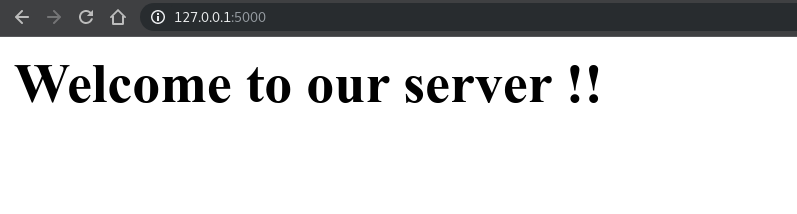
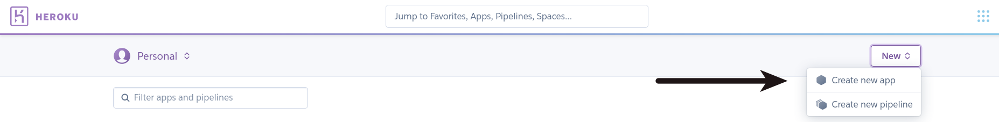
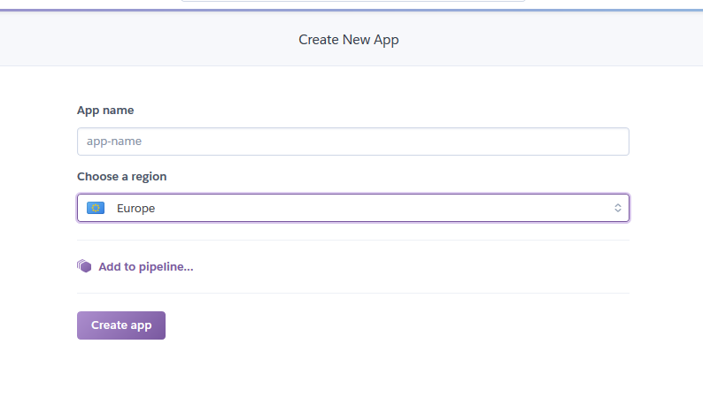
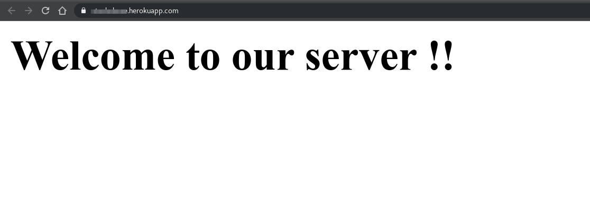
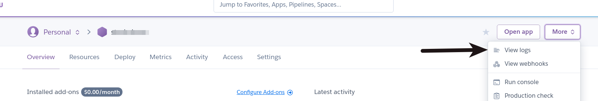

# Web Application Services : the basics

1. [What's a Web App ?](#Introduction)
1. [Heroku](#heroku)
1. [Other solutions](#others)

## Introduction

A web application is an application software that runs on a web server, unlike computer-based software programs that are stored locally on the Operating System (OS) of the device. Web applications are accessed by the user through a web browser with an active internet connection. These applications are programmed using a client–server modeled structure—the user ("client") is provided services through an off-site server that is hosted by a third-party.

## Heroku

In this tutorial you will learn how to deploy a Flask application to Heroku. The app can be as simple as a "Hello World" app to a social media monitoring platform!

Nowadays there is no business that doesn't have a web app to help it a reach greater audience, or maybe provide its services through an online portal.

Today you are about to learn how to make an API using Flask as a case study for how to deploy your app on Heroku.

## Building a REST API with Flask

In your project directory, using your terminal, let's start off by creating a `virtualenv`:

```bash
$ python -m venv venv/
```

And let's activate it with the source command:

```bash
$ source venv/bin/activate
```

Then, let's use `pip` to install the libraries we're going to use - `flask` to build the app and `gunicorn` as our server:

```bash
$ pip install flask
$ pip install gunicorn
```

Our application is going to be a simple API that receives a name and returns a welcome message:

```python
# app.py
from flask import Flask, request, jsonify
app = Flask(__name__)

@app.route('/getmsg/', methods=['GET'])
def respond():
    # Retrieve the name from url parameter
    name = request.args.get("name", None)

    # For debugging
    print(f"got name {name}")

    response = {}

    # Check if user sent a name at all
    if not name:
        response["ERROR"] = "no name found, please send a name."
    # Check if the user entered a number not a name
    elif str(name).isdigit():
        response["ERROR"] = "name can't be numeric."
    # Now the user entered a valid name
    else:
        response["MESSAGE"] = f"Welcome {name} to our awesome platform!!"

    # Return the response in json format
    return jsonify(response)

@app.route('/post/', methods=['POST'])
def post_something():
    param = request.form.get('name')
    print(param)
    # You can add the test cases you made in the previous function,
    # but in our case here you are just testing the POST functionality
    if param:
        return jsonify({
            "Message": f"Welcome {name} to our awesome platform!!",
            # Add this option to distinct the POST request
            "METHOD" : "POST"
        })
    else:
        return jsonify({
            "ERROR": "no name found, please send a name."
        })

# A welcome message to test our server
@app.route('/')
def index():
    return "<h1>Welcome to our server !!</h1>"

if __name__ == '__main__':
    # Threaded option to enable multiple instances for
    # multiple user access support
    app.run(threaded=True, port=5000)
```

To test your application locally, let's hit the [http://127.0.0.1:5000/](http://127.0.0.1:5000/) endpoint. If everything is fine, we should be greeted with a welcome message:



We can also send a name as a parameter, such as [http://localhost:5000/getmsg/?name=Xavier](http://localhost:5000/getmsg/?name=Xavier):

```json
{"MESSAGE":"Welcome Xavier to our awesome platform!!"}
```

With our application ready, let's deploy it to Heroku.

## Heroku

[Heroku](https://www.heroku.com/) is one of the first cloud platform as a service (PaaS) and supports several languages - Ruby, Java, Node.js, Scala, Clojure, Python, PHP, and Go.

The first thing we need to do is define which libraries our application uses. That way, Heroku knows which ones to provide for us, similar to how we install them locally when developing the app.

To achieve this, we need to create a `requirements.txt` file with all of the modules using our terminal:

```bash
$ pip freeze > requirements.txt
```

This way we end up with a `requirements.txt` file that contains the libraries we're using and their versions:

```bash
$ cat requirements.txt
Click==7.0
Flask==1.1.1
gunicorn==19.9.0
itsdangerous==1.1.0
Jinja2==2.10.1
MarkupSafe==1.1.1
Werkzeug==0.15.6
```

**Note:** One of the common mistakes is misspelling requirements, it is a real pain when you debug your code for hours and find out that the app doesn't run because the server didn't download the modules. The only way for Heroku to know the modules that you are using is to add them to the `requirements.txt` file, so be careful!

For Heroku to be able to run our application like it should, we need to define a set of processes/commands that it should run beforehand. These commands are located in the [Procfile](https://devcenter.heroku.com/articles/procfile):

```text
web: gunicorn app:app
```

The `web` command tells Heroku to start a web server for the application, using `gunicorn`. Since our application is called `app.py`, we've set the `app` name to be `app` as well.




Once the application is created on Heroku, we're ready to deploy it online.

## Docker

Create the Dockerfile to build the image and run the Flask application. You could use an Ubuntu or Python base image. I have used Ubuntu as my base image and installed Python in it.

Your dockerfile should look like this:

```dockerfile
FROM ubuntu:latest
RUN apt-get update -y
RUN apt-get install -y python-pip python-dev build-essential
COPY . /app
WORKDIR /app
RUN pip install -r requirements.txt
ENTRYPOINT ["python"]
CMD ["app.py"]
```

Build the Docker image locally and run it to make sure that the service is running locally.

```bash
$ docker build -t flask-heroku:latest .
$ docker run -d -p 5000:5000 flask-heroku
```

Opening localhost on port 5000 should open our “not so complex” output.

[http://localhost:5000](http://localhost:5000)

## Deploying the App to Heroku

Once you have your application running locally, we will start the actual work of deploying it to Heroku.

Login to the Heroku container. It should open the browser and prompt you to login with your Heroku credentials if you are not logged in already.

```bash
$ heroku container:login
```

You should get a message as “Login Succeeded” if everything goes right.

Make sure you are inside the folder where you created the 3 files — `app.py`, `requirements.txt` and the almighty `Dockerfile`.

Execute the following command to create the container onto Heroku

```bash
$ heroku container:push web --app yourawesomeapp
```

You will get the messages below as response which says that the Docker image has been built, tagged and successfully pushed.

We are almost there with completing our deployment. The container is pushed but not released yet. I’m not exactly sure what could be the reason to have it in pushed stage before releasing. Anyways, the below command would release the container.

```bash
$ heroku container:release web --app yourawesomeapp
```

Once it is released, you would get the message saying that it is done.

Now it is time to check out our awesome app running on Heroku.

[https://yourawesomeapp.herokuapp.com](https://yourawesomeapp.herokuapp.com)



Yay! It worked !!

## Testing the API

In case there were any errors, you can access the logs and troubleshoot from there:



You can manually test your app in the browser, by typing the URL and adding the path for the `/getmsg/` route. Though, as applications tend to get more and more complex, it's advised to use tools like [Postman](https://www.postman.com/) .

Now let's test the `GET` request in Postman to our application with a `name` parameter: `https://yourawesomeapp.herokuapp.com/getmsg/?name=Xavier`

**Status : 200 OK**

```json
{
	"MESSAGE": "Welcome Xavier to our awesome platform!!"
}
```

Still in Postman, let's test a URL that isn't bound to any function, like for example `/newurl`, with a `GET` request: `https://yourawesomeapp.herokuapp.com/newurl/`

**Status : 404 NOT FOUND**

```html
<!DOCTYPE HTML PUBLIC "-//WC//DTD HTML 3.2 Final//EN">
<title>404 Not Found</title>
<h1>Not Found</h1>
<p>The requested URL was not found on the server. If you entered the URL manually please check your spelling and try again</p>
```

As expected, our Flask app returned a 404 response.

**Note:** You can change the view of the output from **Pretty**, **Raw**, and **Preview**, which shows you how the output would look in your browser.

Now let's test a `POST` request: `https://yourawesomeapp.herokuapp.com/post/`

- Select the `Body` tab
- Set the `KEY` to `name`
- Set the `VALUE` to `Xavier` (Your firstname...)

```json
{
	"METHOD" : "POST",
	"MESSAGE": "Welcome Xavier to our awesome platform!!"
}
```

Also, let's see what happens if we completely omit the `name` parameter:

```json
{"ERROR":"no name found, please send a name."}
```

We've tested our app and confirmed that everything is working fine.

For more info on Heroku you can check the Heroku [manual itself.](https://devcenter.heroku.com/articles/getting-started-with-python)

## Others

### AWS EC2

[Amazon Elastic Compute Cloud](https://aws.amazon.com/ec2/) (Amazon EC2) is a web service that provides secure, resizable compute capacity in the cloud. It is designed to make web-scale cloud computing easier for developers. Amazon EC2’s simple web service interface allows you to obtain and configure capacity with minimal friction. It provides you with complete control of your computing resources and lets you run on Amazon’s proven computing environment.

AWS has been around for quite some time now and allows you do to pretty much everything, like the [AWS S3 servers](https://aws.amazon.com/s3/?nc1=h_ls) that provides storage and fast computing capabilities and thus very useful to train Neural Networks. AWS certifications are also really valuables by a lot of companies.

The huge challenge is learning how all those services works. You can take a look at [Amazon Elastic Beanstalk](https://aws.amazon.com/elasticbeanstalk/?nc1=h_ls) .

**Please be careful because the pricing can escalate pretty quickly.**

[Deploy Flask app on AWS EC2 tutorial](https://www.codementor.io/@dushyantbgs/deploying-a-flask-application-to-aws-gnva38cf0)

### Azure

[Microsoft Azure Countainer Instances](https://azure.microsoft.com/en-us/services/container-instances/) also allows you to run containers on their platform.

Microsoft Azure is one of the most used Wep Application Service, like Amazon's AWS and the certifications are also highly valuable for companies.

**Please be careful because the pricing can escalate pretty quickly.**

[Deploy Flask app on Azure tutorial](https://medium.com/@alexjsanchez/creating-and-deploying-a-flask-app-with-docker-on-azure-in-5-easy-9f7aa7a12145)
