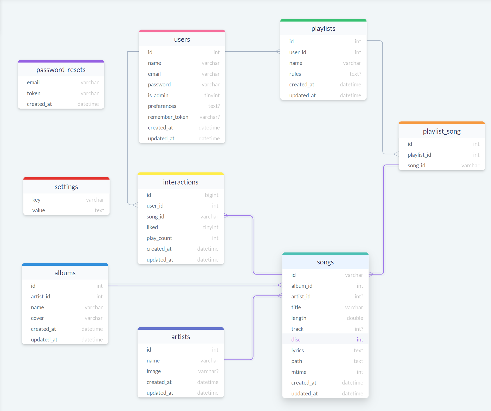

# Database : the basics

1. [SQL](#sql)
2. [SQLite](#sqlite)
3. [PostgreSQL](#postgresql)
4. [MongoDB](#mongodb)

## SQL

**SQL**(Structured Query Language) is a domain-specific language used in programming and designed for managing data held in a relational database management system (RDBMS), or for stream processing in a relational data stream management system (RDSMS). It is particularly useful in handling structured data, i.e. data incorporating relations among entities and variables.

SQL offers three main advantages over older read–write APIs such as ISAM or VSAM. Firstly, it introduced the concept of accessing many records with one single command. Secondly, it eliminates the need to specify how to reach a record, e.g. with or without an index. Finally, SQL uses a human-readable syntax that allows users to be quickly productive without a requirement for long-term, technical training.

Take a look at what a relational database looks like :

You can build your own Database with SQL queries only. But you'll need a system to make it run like [MySQL](https://www.mysql.com/) or [PostgreSQL](#PostgreSQL) or a library like [SQLite](#SQLite).

[Here is a good tutorial to learn SQL.](https://www.w3schools.com/sql/)

For Python, you have an awesome toolkit to help you interact with SQL Databases called [SQLAlchemy](https://www.sqlalchemy.org/)

## SQLite

SQLite is a software library that provides a relational database management system. The lite in SQLite means lightweight in terms of setup, database administration, and required resources.

SQLite has the following noticeable features: serverless, self-contained, zero-configuration, transactional.

### Serverless

Normally, a RDBMS such as MySQL, PostgreSQL, etc., requires a separate server process to operate. The applications that want to access the database server use TCP/IP protocol to send and receive requests. This is called client/server architecture.

SQLite does NOT work this way.

SQLite does NOT require a server to run.

SQLite database is integrated with the application that accesses the database. The applications interact with the SQLite database and read/write directly from the database files stored on disk.

### Self-Contained

SQLite is self-contained, which means it requires minimal support from the operating system or external libraries. This makes SQLite usable in any environment, especially in embedded devices like iPhones, Android phones, game consoles, handheld media players, etc.

SQLite is developed using ANSI-C. The source code is available as a big sqlite3.c and its header file sqlite3.h. If you want to develop an application that uses SQLite, you just need to drop these files into your project and compile it with your code.

### Zero-configuration

Because of the serverless architecture, you don’t need to “install” SQLite before using it. There is no server process that needs to be configured, started, and stopped.

In addition, SQLite does not use any configuration files.

### Transactional

All transactions in SQLite are fully ACID-compliant. It means all queries and changes are Atomic, Consistent, Isolated, and Durable.

In other words, all changes within a transaction take place completely or not at all even when an unexpected situation happens, like when an application crash, a power failure, or an operating system crash occurs.

### SQLite distinctive features

SQLite uses dynamic types for tables. It means you can store any value in any column, regardless of the data type.

SQLite allows a single database connection to access multiple database files simultaneously. This brings many nice features like joining tables in different databases or copying data between databases in a single command.

SQLite is capable of creating in-memory databases that are very fast to work with.

### Links

[How To Download & Install SQLite Tools](https://www.sqlitetutorial.net/download-install-sqlite/)

[SQLite Sample Database](https://www.sqlitetutorial.net/sqlite-sample-database/)

[SQLite Python](https://www.sqlitetutorial.net/sqlite-python/)

## PostgreSQL

**PostgreSQL** is an advanced, enterprise-class, and open-source relational database system. PostgreSQL supports both SQL (relational) and JSON (non-relational) querying.

PostgreSQL is a highly stable database backed by more than 20 years of development by the open-source community.

PostgreSQL is used as a primary database for many web applications as well as mobile and analytics applications.

### Common Use cases of PostgreSQL

The following are the common use cases of PostgreSQL.

1. **A robust database in the LAPP stack**.

    LAPP stands for Linux, Apache, PostgreSQL, and PHP (or Python and Perl). PostgreSQL is primarily used as a robust back-end database that powers many dynamic websites and web applications.

2. **General purpose transaction database.**

    Large corporations and startups alike use PostgreSQL as primary databases to support their applications and products.

3. **Geospatial database.**

    PostgreSQL with the PostGIS extension supports geospatial databases for geographic information systems (GIS).

### Links

[Install PostgreSQL on Windows](https://www.postgresqltutorial.com/install-postgresql/)

[Install PostgreSQL macOS](https://www.postgresqltutorial.com/install-postgresql-macos/)

[Install PostgreSQL Linux](https://www.postgresqltutorial.com/install-postgresql-linux/)

[PostgreSQL Sample Database](https://www.postgresqltutorial.com/postgresql-sample-database/)

[Connect To a PostgreSQL Database Server](https://www.postgresqltutorial.com/connect-to-postgresql-database/)

[PostgreSQL Python: Connect To PostgreSQL Database Server](https://www.postgresqltutorial.com/postgresql-python/connect/)

### Bonus

You can find free services to host your PostgreSQL Database like [ElephantSQL](https://www.elephantsql.com/) .

## MongoDB

MongoDB is a cross-platform document-oriented database program. Classified as a **NoSQL** database program, MongoDB uses JSON-like documents with optional schemas.

MongoDB is used for high volume data storage. Instead of using tables and rows as in the traditional relational databases, MongoDB makes use of collections and documents. Documents consist of key-value pairs which are the basic unit of data in MongoDB. Collections contain sets of documents and function which is the equivalent of relational database tables.

### Limitations of Relational databases

1. In relational database we need to define the structure and schema of data first and  only then can we process the data.

2. Relational database systems provide consistency and integrity of data by enforcing ACID properties (Atomicity, Consistency, Isolation and Durability ). There are some scenarios where this is useful like banking systems. However, in most of the other cases these properties are significant performance overheads and can make your database response very slow.

3. Most of the applications store their data in JSON format and RDBMS don’t provide a better way of performing operations such as create, insert, update, delete, etc... on this data. On the other hand, NoSQL databases store their data in JSON format, which is compatible with most of today’s application.

### What are the advantages of NoSQL

There are several advantages of working with NoSQL databases such as MongoDB and Cassandra. The main advantages are high scalability and high availability.

**High scalability:** NoSQL databases such as MongoDB use sharding for horizontal scaling. Sharding is partitioning of data and placing it on multiple machines in such a way that the order of the data is preserved. Vertical scaling means adding more resources to the existing machine while horizontal scaling means adding more machines to handle the data. Vertical scaling is not that easy to implement, on the other hand horizontal scaling is easy to implement. Horizontal scaling database examples: MongoDB, Cassandra, etc... Because of this feature, NoSQL databases can handle huge amounts of data, and as the data grows, NoSQL databases scale themselves to handle that data in an efficient manner.

**High Availability:** Auto replication feature in MongoDB makes it highly available because in case of any failure, data replicates itself to the previous consistent state.

### When to go for NoSQL

When you would want to choose NoSQL over relational database:

1. When you want to store and retrieve huge amounts of data.
2. The relationship between the data you store is not that important
3. The data is not structured and changes over time
4. Constraints and join support is not required at the database level
5. The data is growing continuously and you need to scale the database regularly to handle the data.

### Links

[Getting started with MongoDB](https://docs.mongodb.com/manual/tutorial/)

[Python MongoDB Tutorial](https://api.mongodb.com/python/current/tutorial.html)
