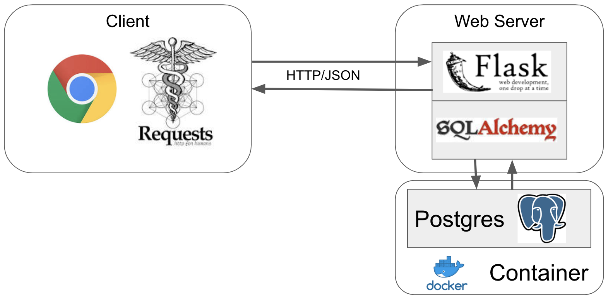

# Deployment

1. [Flask](1.Flask/1.Introduction.ipynb)
2. [Docker](2.Docker/1.Introduction.ipynb)
3. [Database](3.Database/README.md)
4. [Web Application](4.Web_Application/README.md)
5. [Deploy Jupyter](5.deploy_jupyter/04.Expose_jupyter/Expose_your_jupyter.ipynb)

In this course we are gonna show you how to properly deploy your application to the public using Docker, Flask, different types of Databases as well as Web Services.

**Note : Check out your GitHub Student Developer Pack for free credits on Web Services and Databases (Azure, AWS, Heroku, MongoDB Atlas). But be careful to use it wisely.**

